# GW2STYLE Backend - Architecture & Business Logic

## 📋 Table of Contents

- [System Architecture](#system-architecture)
- [Authentication Flow](#authentication-flow)
- [Post Creation Workflow](#post-creation-workflow)
- [Discord Moderation System](#discord-moderation-system)
- [Like System](#like-system)
- [Search & Filtering](#search--filtering)
- [Middleware Chain](#middleware-chain)
- [Error Handling](#error-handling)
- [Key Design Patterns](#key-design-patterns)

---

## System Architecture

### High-Level Architecture


### Component Responsibilities

#### 1. REST API Server (`rest/`)
- **Purpose**: Handle HTTP requests and business logic
- **Responsibilities**:
  - Route requests to appropriate handlers
  - Validate and authenticate requests
  - Execute business logic
  - Return formatted responses
- **Technology**: Go `net/http` stdlib

#### 2. Discord Bot (`bot/`)
- **Purpose**: Content moderation via Discord
- **Responsibilities**:
  - Listen for emoji reactions on moderation messages
  - Call backend APIs to publish/reject posts
  - Send notifications to moderation and public channels
- **Technology**: `discordgo` library

#### 3. Repository Layer (`repo/`)
- **Purpose**: Data access abstraction
- **Responsibilities**:
  - Execute database queries
  - Map database rows to Go structs
  - Handle transactions
- **Technology**: `sqlx` for SQL execution

#### 4. Middleware Layer (`rest/middlewares/`)
- **Purpose**: Cross-cutting concerns
- **Responsibilities**:
  - Authentication (JWT, Bot token)
  - CORS handling
  - Request logging
  - Panic recovery
- **Technology**: Custom middleware chain

---

## Authentication Flow

### GW2 API Key Authentication


### Key Steps

1. **API Key Validation**
   - Validate key format
   - Check required permissions: `account`, `characters`, `builds`
   - Call GW2 API `/v2/tokeninfo`

2. **Account Fetching**
   - Call GW2 API `/v2/account`
   - Extract `id` and `name` (username)

3. **User Creation/Update**
   - Check if user exists by `id`
   - Create new user or update existing API key
   - Store encrypted API key

4. **JWT Generation**
   - Create JWT with payload: `{user_id, username}`
   - Sign with `JWT_SECRET`
   - Set expiration (default: 7 days)

5. **Response**
   - Return user object and JWT token
   - Frontend stores token in localStorage/cookie

### JWT Token Structure

```json
{
  "user_id": "12345678-1234-1234-1234-123456789012",
  "username": "PlayerName.1234",
  "exp": 1735689600,
  "iat": 1735084800
}
```

### Authentication Middleware

```go
// Middleware validates JWT and sets user context
func (m *Middleware) AuthenticateJWT(next http.Handler) http.Handler {
    return http.HandlerFunc(func(w http.ResponseWriter, r *http.Request) {
        // Extract token from Authorization header
        // Validate and parse JWT
        // Set user info in request context
        // Call next handler
    })
}
```

---

## Post Creation Workflow

### Complete Post Lifecycle

```mermaid
sequenceDiagram
    participant User
    participant Frontend
    participant Backend
    participant DB as Database
    participant Webhook as Discord Webhook
    participant Bot as Discord Bot
    participant Moderator
    
    User->>Frontend: Fill post form
    Frontend->>Backend: POST /api/v1/posts/create
    Backend->>Backend: Validate JWT
    Backend->>Backend: Validate post data
    
    Backend->>DB: INSERT post (published=false)
    DB-->>Backend: Post ID
    
    Backend->>Webhook: Send moderation notification
    Webhook->>Bot: Post created event
    Bot->>Moderator: Discord message with ✅/❌ reactions
    
    Backend-->>Frontend: 201 Created {post_id}
    Frontend-->>User: Post submitted for review
    
    alt Moderator Approves (✅)
        Moderator->>Bot: React with ✅
        Bot->>Backend: POST /admin/posts/{id}/publish
        Backend->>DB: UPDATE published=true
        Bot->>Moderator: Update message (Approved)
        Bot->>Webhook: Announce to public channel
    else Moderator Rejects (❌)
        Moderator->>Bot: React with ❌
        Bot->>Backend: POST /admin/posts/{id}/reject
        Backend->>DB: Keep published=false
        Bot->>Moderator: Update message (Rejected)
    end
```



### Validation Rules

**Title**:
- Required
- Max length: 250 characters
- No special characters (sanitized)

**Images**:
- At least `thumbnail_url` required
- Valid URL format
- Supported domains: Imgur, Google Drive, etc.

**Tags**:
- Array of strings
- Max 10 tags per post
- Each tag max 30 characters

**Equipment**:
- JSON object (optional)
- Validated structure

### Post States

| State | `published` | Visible to Public | Description |
|-------|-------------|-------------------|-------------|
| **Pending** | `false` | ❌ | Awaiting moderation |
| **Published** | `true` | ✅ | Approved and visible |
| **Rejected** | `false` | ❌ | Rejected by moderator |
| **Deleted** | `false` | ❌ | Soft-deleted by author |

---

## Discord Moderation System

### Architecture


### Moderation Workflow

1. **Post Submission**
   - User creates post via API
   - Post saved with `published = false`
   - Webhook sent to Discord moderation channel

2. **Discord Notification**
   ```
   📝 New Post Submission
   
   Title: Elegant Sylvari Light Armor
   Author: PlayerName.1234
   Post ID: 123
   
   React with:
   ✅ to approve
   ❌ to reject
   ```

3. **Moderator Action**
   - Moderator reacts with ✅ or ❌
   - Bot detects reaction event
   - Bot extracts post ID from message

4. **Approval Flow**
   - Bot calls `POST /admin/posts/{id}/publish`
   - Backend validates bot token
   - Database updates `published = true`
   - Moderation log entry created
   - Bot announces to public channel

5. **Rejection Flow**
   - Bot calls `POST /admin/posts/{id}/reject`
   - Backend validates bot token
   - Post remains `published = false`
   - Moderation log entry created
   - Original message updated

### Bot Authentication

Discord bot uses a shared secret token:

```go
// Bot authentication middleware
func (m *Middleware) AuthenticateBot(next http.Handler) http.Handler {
    return http.HandlerFunc(func(w http.ResponseWriter, r *http.Request) {
        token := r.Header.Get("X-Bot-Token")
        if token != m.config.DiscordBotToken {
            http.Error(w, "Unauthorized", 401)
            return
        }
        next.ServeHTTP(w, r)
    })
}
```

### Moderation Log

Every moderation action is logged:

```sql
INSERT INTO moderation_log (
    post_id, 
    action, 
    moderator_username, 
    moderator_discord_id, 
    reason
) VALUES (
    123, 
    'publish', 
    'ModeratorName#1234', 
    '123456789012345678', 
    NULL
);
```

---

## Like System

### Like/Unlike Flow


### Implementation Details

**Like Storage** (Current):
- Stored in `users.liked_posts` JSON array
- Post `likes_count` cached in `posts` table

**Like Storage** (Future - v0.3):
```sql
CREATE TABLE likes (
    user_id VARCHAR REFERENCES users(id),
    post_id INTEGER REFERENCES posts(id),
    created_at TIMESTAMPTZ DEFAULT NOW(),
    PRIMARY KEY (user_id, post_id)
);
```

### Optimistic UI Updates

Frontend implements optimistic updates:
1. User clicks like → UI updates immediately
2. API request sent in background
3. On error → rollback UI change
4. On success → confirm UI state

---

## Search & Filtering

### Search Query Flow


### Tag Filtering

Uses PostgreSQL JSONB operators:

```sql
-- Single tag
SELECT * FROM posts 
WHERE tags @> '["light"]'::jsonb;

-- Multiple tags (AND)
SELECT * FROM posts 
WHERE tags @> '["light", "sylvari"]'::jsonb;

-- Multiple tags (OR)
SELECT * FROM posts 
WHERE tags ?| array['light', 'medium', 'heavy'];
```

### Full-Text Search

```sql
-- Search in title and description
SELECT * FROM posts
WHERE published = true
  AND (
    title ILIKE '%legendary%' 
    OR description ILIKE '%legendary%'
  )
ORDER BY created_at DESC;
```

### Performance Optimization

- **GIN Index**: Fast tag lookups
- **Partial Index**: Only published posts
- **Pagination**: Limit results to prevent large scans
- **Caching**: Cache popular searches (planned)

---

## Middleware Chain

### Middleware Execution Order


### Middleware Responsibilities

#### 1. CORS Middleware
```go
// Allow cross-origin requests from frontend
AllowedOrigins: ["http://localhost:3000", "https://gw2style.com"]
AllowedMethods: ["GET", "POST", "PUT", "DELETE", "OPTIONS"]
AllowedHeaders: ["Authorization", "Content-Type"]
AllowCredentials: true
```

#### 2. Logger Middleware
```go
// Log every request
[INFO] 2025-12-05 22:00:00 | GET /api/v1/posts | 200 | 45ms
[INFO] 2025-12-05 22:00:01 | POST /api/v1/login | 401 | 120ms
```

#### 3. Recovery Middleware
```go
// Catch panics and return 500 error
defer func() {
    if err := recover(); err != nil {
        log.Error("Panic recovered", "error", err)
        http.Error(w, "Internal Server Error", 500)
    }
}()
```

#### 4. Auth Middleware
```go
// Validate JWT token
// Extract user info
// Set in request context
```

### Middleware Manager

```go
// Chain middlewares together
manager.With(
    http.HandlerFunc(handler),
    middleware1,
    middleware2,
    middleware3,
)
```

---

## Error Handling

### Error Response Format

```json
{
  "success": false,
  "error": "Human-readable error message"
}
```

### Error Categories

| Category | HTTP Code | Example |
|----------|-----------|---------|
| **Validation** | 400 | Invalid request body |
| **Authentication** | 401 | Invalid JWT token |
| **Authorization** | 403 | Not post owner |
| **Not Found** | 404 | Post does not exist |
| **Conflict** | 409 | Already liked |
| **Server Error** | 500 | Database connection failed |

### Error Handling Pattern

```go
func (h *Handlers) SomeHandler(w http.ResponseWriter, r *http.Request) {
    // Parse request
    var req RequestStruct
    if err := json.NewDecoder(r.Body).Decode(&req); err != nil {
        h.sendError(w, 400, "Invalid request body")
        return
    }
    
    // Validate
    if err := validate.Struct(req); err != nil {
        h.sendError(w, 400, err.Error())
        return
    }
    
    // Execute business logic
    result, err := h.repo.DoSomething(req)
    if err != nil {
        log.Error("Database error", "error", err)
        h.sendError(w, 500, "Internal server error")
        return
    }
    
    // Success response
    h.sendData(w, 200, result)
}
```

---

## Key Design Patterns

### 1. Repository Pattern

**Purpose**: Separate data access from business logic

```go
// Repository interface
type PostRepository interface {
    GetPosts(ctx context.Context, limit, offset int) ([]Post, error)
    Create(post Post) (*Post, error)
    GetByID(ctx context.Context, id string) (*Post, error)
}

// Implementation
type postRepository struct {
    db *sql.DB
}

func (r *postRepository) GetPosts(ctx context.Context, limit, offset int) ([]Post, error) {
    // Database query logic
}
```

### 2. Dependency Injection

**Purpose**: Loose coupling and testability

```go
// Handler receives dependencies via constructor
func NewHandler(config *Config, db *sqlx.DB, userRepo UserRepo) *Handlers {
    return &Handlers{
        config: config,
        db: db,
        userRepo: userRepo,
        postRepo: NewPostRepository(db),
    }
}
```

### 3. Middleware Chain

**Purpose**: Composable request processing

```go
// Middleware interface
type Middleware func(http.Handler) http.Handler

// Chaining
handler = cors(logger(auth(actualHandler)))
```

### 4. Context Propagation

**Purpose**: Pass request-scoped data

```go
// Set user in context
ctx := context.WithValue(r.Context(), "user", user)
r = r.WithContext(ctx)

// Retrieve user from context
user := r.Context().Value("user").(*User)
```

---

## Performance Considerations

### 1. Database Connection Pooling
```go
DB_MAX_OPEN_CONNS=20
DB_MAX_IDLE_CONNS=20
DB_MAX_IDLE_TIME_IN_MINUTES=60
```

### 2. Query Optimization
- Use indexes for common queries
- Limit result sets with pagination
- Avoid N+1 queries

### 3. Caching Strategy (Planned)
- Cache popular posts
- Cache leaderboard
- Cache user sessions

### 4. Concurrent Request Handling
- Go's goroutines handle concurrent requests
- Database connection pool prevents overload

---

## Security Best Practices

1. **JWT Secret**: Strong random secret, never commit to Git
2. **API Key Encryption**: Encrypt before storing in database
3. **SQL Injection**: Always use parameterized queries
4. **CORS**: Restrict allowed origins in production
5. **Rate Limiting**: Prevent abuse (planned)
6. **Input Validation**: Validate all user inputs
7. **Error Messages**: Don't leak sensitive information

---

**Last Updated**: December 2025  
**Version**: 0.2.0
