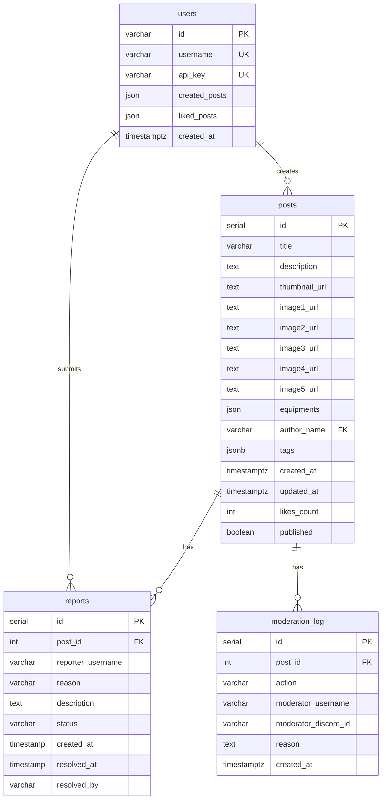

# GW2STYLE Backend - Database Schema Documentation

## 📋 Overview

GW2STYLE uses **PostgreSQL 17+** as its primary database. The schema is designed to support:

- User authentication via GW2 API keys
- Post creation and management
- Like/reaction system
- Content moderation workflow
- Audit logging

**Migration Tool**: `sql-migrate`  
**Total Tables**: 4  
**Schema Version**: 00004

---

## 🗂️ Database Tables

### Table of Contents
1. [users](#1-users-table)
2. [posts](#2-posts-table)
3. [reports](#3-reports-table)
4. [moderation_log](#4-moderation_log-table)

---

## 1. `users` Table

Stores Guild Wars 2 player accounts authenticated via API keys.

### Schema

```sql
CREATE TABLE IF NOT EXISTS users (
    id VARCHAR PRIMARY KEY UNIQUE NOT NULL,
    username VARCHAR NOT NULL UNIQUE,
    api_key VARCHAR NOT NULL UNIQUE,
    created_posts JSON,
    liked_posts JSON,
    created_at TIMESTAMPTZ DEFAULT now()
);
```

### Columns

| Column | Type | Constraints | Description |
|--------|------|-------------|-------------|
| `id` | VARCHAR | PRIMARY KEY, UNIQUE, NOT NULL | GW2 account ID from API |
| `username` | VARCHAR | UNIQUE, NOT NULL | GW2 account name (e.g., "PlayerName.1234") |
| `api_key` | VARCHAR | UNIQUE, NOT NULL | Encrypted GW2 API key |
| `created_posts` | JSON | - | Array of post IDs created by user (deprecated) |
| `liked_posts` | JSON | - | Array of post IDs liked by user (deprecated) |
| `created_at` | TIMESTAMPTZ | DEFAULT now() | Account creation timestamp |

### Indexes

- **Primary Key**: `id`
- **Unique Constraints**: `username`, `api_key`

### Relationships

- **One-to-Many** with `posts` (via `author_name` → `username`)
- **One-to-Many** with `reports` (via `reporter_username` → `username`)

### Notes

> **Security**: API keys should be encrypted at rest. Consider using PostgreSQL's `pgcrypto` extension or application-level encryption.

> **Deprecated Fields**: `created_posts` and `liked_posts` JSON fields are deprecated in favor of foreign key relationships. These may be removed in future migrations.

### Migration File

`db/migrations/00001-create-users-up.sql`

---

## 2. `posts` Table

Stores outfit submissions with equipment details and metadata.

### Schema

```sql
CREATE TABLE IF NOT EXISTS posts (
    id SERIAL PRIMARY KEY,
    title VARCHAR(250) NOT NULL,
    description TEXT,
    thumbnail_url TEXT,
    image1_url TEXT,
    image2_url TEXT,
    image3_url TEXT,
    image4_url TEXT,
    image5_url TEXT,
    equipments JSON,
    author_name VARCHAR,
    tags JSONB DEFAULT '[]'::jsonb,
    created_at TIMESTAMPTZ DEFAULT now(),
    updated_at TIMESTAMPTZ,
    likes_count INT DEFAULT 0,
    published BOOLEAN DEFAULT FALSE,
    CONSTRAINT fk_author FOREIGN KEY (author_name) 
        REFERENCES users (username) ON DELETE SET NULL
);

-- Indexes
CREATE INDEX IF NOT EXISTS idx_posts_tags 
    ON posts USING GIN (tags);

CREATE INDEX IF NOT EXISTS idx_posts_published_tags 
    ON posts USING GIN (tags) WHERE published = true;
```

### Columns

| Column | Type | Constraints | Description |
|--------|------|-------------|-------------|
| `id` | SERIAL | PRIMARY KEY | Auto-incrementing post ID |
| `title` | VARCHAR(250) | NOT NULL | Post title (max 250 chars) |
| `description` | TEXT | - | Detailed outfit description |
| `thumbnail_url` | TEXT | - | Main thumbnail image URL |
| `image1_url` | TEXT | - | Additional image URL |
| `image2_url` | TEXT | - | Additional image URL |
| `image3_url` | TEXT | - | Additional image URL |
| `image4_url` | TEXT | - | Additional image URL |
| `image5_url` | TEXT | - | Additional image URL |
| `equipments` | JSON | - | Equipment details (armor, weapons, etc.) |
| `author_name` | VARCHAR | FOREIGN KEY | References `users.username` |
| `tags` | JSONB | DEFAULT '[]' | Array of tags for filtering |
| `created_at` | TIMESTAMPTZ | DEFAULT now() | Post creation timestamp |
| `updated_at` | TIMESTAMPTZ | - | Last update timestamp |
| `likes_count` | INT | DEFAULT 0 | Cached like count |
| `published` | BOOLEAN | DEFAULT FALSE | Moderation status |

### Indexes

| Index Name | Type | Columns | Purpose |
|------------|------|---------|---------|
| `idx_posts_tags` | GIN | `tags` | Fast tag filtering |
| `idx_posts_published_tags` | GIN (Partial) | `tags` WHERE `published = true` | Optimized for published posts |

### Foreign Keys

- `fk_author`: `author_name` → `users.username` (ON DELETE SET NULL)

### Relationships

- **Many-to-One** with `users` (via `author_name`)
- **One-to-Many** with `reports`
- **One-to-Many** with `moderation_log`

### Equipment JSON Structure

The `equipments` column stores a JSON object with the following structure:

```json
{
  "head": "Item Name",
  "shoulders": "Item Name",
  "chest": "Item Name",
  "gloves": "Item Name",
  "legs": "Item Name",
  "boots": "Item Name",
  "weapon1": "Weapon Name",
  "weapon2": "Weapon Name",
  "backpack": "Backpack Name",
  "accessory1": "Accessory Name",
  "accessory2": "Accessory Name"
}
```

### Tags JSONB Structure

Tags are stored as a JSONB array for efficient querying:

```json
["light", "sylvari", "elegant", "legendary"]
```

**Common Tags**:
- **Armor Weight**: `light`, `medium`, `heavy`
- **Race**: `human`, `norn`, `sylvari`, `asura`, `charr`
- **Theme**: `elegant`, `casual`, `edgy`, `legendary`, `cultural`

### Notes

> **GIN Indexes**: The GIN (Generalized Inverted Index) indexes enable fast tag filtering queries. The partial index `idx_posts_published_tags` is optimized for the most common query pattern (published posts with tags).

> **Soft Delete**: Posts are soft-deleted by setting `published = false` rather than removing rows. This preserves audit history.

> **Image Storage**: Images are stored as external URLs (Imgur, Google Drive, etc.) to avoid storage costs.

### Migration File

`db/migrations/00002-create-posts-up.sql`

---

## 3. `reports` Table

Stores user-submitted reports for inappropriate content.

### Schema

```sql
CREATE TABLE IF NOT EXISTS reports (
    id SERIAL PRIMARY KEY,
    post_id INTEGER NOT NULL REFERENCES posts(id) ON DELETE CASCADE,
    reporter_username VARCHAR(255) NOT NULL,
    reason VARCHAR(50) NOT NULL,
    description TEXT,
    status VARCHAR(20) DEFAULT 'pending' 
        CHECK (status IN ('pending', 'resolved', 'dismissed')),
    created_at TIMESTAMP DEFAULT NOW(),
    resolved_at TIMESTAMP,
    resolved_by VARCHAR(255)
);
```

### Columns

| Column | Type | Constraints | Description |
|--------|------|-------------|-------------|
| `id` | SERIAL | PRIMARY KEY | Auto-incrementing report ID |
| `post_id` | INTEGER | NOT NULL, FOREIGN KEY | References `posts.id` |
| `reporter_username` | VARCHAR(255) | NOT NULL | Username of reporter |
| `reason` | VARCHAR(50) | NOT NULL | Report reason code |
| `description` | TEXT | - | Additional details |
| `status` | VARCHAR(20) | DEFAULT 'pending', CHECK | Report status |
| `created_at` | TIMESTAMP | DEFAULT NOW() | Report submission time |
| `resolved_at` | TIMESTAMP | - | Resolution timestamp |
| `resolved_by` | VARCHAR(255) | - | Moderator who resolved |

### Foreign Keys

- `post_id` → `posts.id` (ON DELETE CASCADE)

### Status Values

| Status | Description |
|--------|-------------|
| `pending` | Report awaiting review |
| `resolved` | Report reviewed and action taken |
| `dismissed` | Report reviewed but no action needed |

### Reason Codes

Common reason codes:
- `spam` - Spam or advertising
- `nsfw` - NSFW content
- `offensive` - Offensive or hateful content
- `off-topic` - Not related to GW2 fashion
- `other` - Other reasons (see description)

### Relationships

- **Many-to-One** with `posts`

### Migration File

`db/migrations/00003-create-reports-up.sql`

---

## 4. `moderation_log` Table

Audit log for all moderation actions (approvals, rejections).

### Schema

```sql
CREATE TABLE IF NOT EXISTS moderation_log (
    id SERIAL PRIMARY KEY,
    post_id INTEGER NOT NULL REFERENCES posts(id) ON DELETE CASCADE,
    action VARCHAR(50) NOT NULL,
    moderator_username VARCHAR(255) NOT NULL,
    moderator_discord_id VARCHAR(255),
    reason TEXT,
    created_at TIMESTAMPTZ DEFAULT NOW()
);

-- Indexes
CREATE INDEX IF NOT EXISTS idx_moderation_log_post_id 
    ON moderation_log(post_id);

CREATE INDEX IF NOT EXISTS idx_moderation_log_created_at 
    ON moderation_log(created_at DESC);
```

### Columns

| Column | Type | Constraints | Description |
|--------|------|-------------|-------------|
| `id` | SERIAL | PRIMARY KEY | Auto-incrementing log ID |
| `post_id` | INTEGER | NOT NULL, FOREIGN KEY | References `posts.id` |
| `action` | VARCHAR(50) | NOT NULL | Action type (publish, reject) |
| `moderator_username` | VARCHAR(255) | NOT NULL | Discord username of moderator |
| `moderator_discord_id` | VARCHAR(255) | - | Discord user ID |
| `reason` | TEXT | - | Reason for action (optional) |
| `created_at` | TIMESTAMPTZ | DEFAULT NOW() | Action timestamp |

### Indexes

| Index Name | Type | Columns | Purpose |
|------------|------|---------|---------|
| `idx_moderation_log_post_id` | B-tree | `post_id` | Fast lookups by post |
| `idx_moderation_log_created_at` | B-tree | `created_at DESC` | Recent actions query |

### Foreign Keys

- `post_id` → `posts.id` (ON DELETE CASCADE)

### Action Types

| Action | Description |
|--------|-------------|
| `publish` | Post approved and published |
| `reject` | Post rejected |
| `unpublish` | Published post removed |

### Relationships

- **Many-to-One** with `posts`

### Notes

> **Audit Trail**: This table provides a complete audit trail of all moderation decisions. Rows should never be deleted.

> **Discord Integration**: Moderator information is captured from Discord bot events.

### Migration File

`db/migrations/00004-create-moderation-log-up.sql`

---

## 📊 Entity Relationship Diagram



---

## 🔄 Migration System

### Migration Tool

The project uses **sql-migrate** for database migrations.

### Migration Files Location

```
backend/db/migrations/
├── 00001-create-users-up.sql
├── 00002-create-posts-up.sql
├── 00003-create-reports-up.sql
└── 00004-create-moderation-log-up.sql
```

### Running Migrations

Migrations are automatically run on application startup via `db/migrate.go`.

**Manual Migration**:
```bash
# Run all pending migrations
go run . migrate up

# Rollback last migration
go run . migrate down
```

### Migration Naming Convention

```
<sequence>-<description>-<direction>.sql
```

- **Sequence**: 5-digit number (e.g., 00001)
- **Description**: Kebab-case description
- **Direction**: `up` or `down`

### Creating New Migrations

1. Create a new file in `db/migrations/`:
   ```
   00005-add-user-profiles-up.sql
   ```

2. Add migration SQL with header:
   ```sql
   -- +migrate Up
   CREATE TABLE ...
   ```

3. Restart the application to apply migrations.

---

## 🔍 Common Queries

### Get All Published Posts with Tags

```sql
SELECT id, title, thumbnail_url, author_name, likes_count
FROM posts
WHERE published = true
  AND tags @> '["light", "sylvari"]'::jsonb
ORDER BY created_at DESC
LIMIT 20 OFFSET 0;
```

### Get User's Posts

```sql
SELECT id, title, created_at, likes_count, published
FROM posts
WHERE author_name = 'PlayerName.1234'
ORDER BY created_at DESC;
```

### Get Popular Posts (Last 7 Days)

```sql
SELECT id, title, thumbnail_url, author_name, likes_count
FROM posts
WHERE published = true
  AND created_at >= NOW() - INTERVAL '7 days'
ORDER BY likes_count DESC
LIMIT 10;
```

### Get Pending Reports

```sql
SELECT r.id, r.post_id, p.title, r.reason, r.created_at
FROM reports r
JOIN posts p ON r.post_id = p.id
WHERE r.status = 'pending'
ORDER BY r.created_at ASC;
```

### Get Moderation History for Post

```sql
SELECT action, moderator_username, reason, created_at
FROM moderation_log
WHERE post_id = 123
ORDER BY created_at DESC;
```

---

## 🛡️ Security Considerations

### 1. API Key Encryption

> **⚠️ IMPORTANT**: API keys should be encrypted before storage.

**Recommended Approach**:
- Use PostgreSQL `pgcrypto` extension
- Or encrypt at application level before INSERT

**Example with pgcrypto**:
```sql
-- Enable extension
CREATE EXTENSION IF NOT EXISTS pgcrypto;

-- Insert encrypted API key
INSERT INTO users (id, username, api_key)
VALUES ('123', 'Player.1234', pgp_sym_encrypt('API_KEY', 'encryption_key'));

-- Decrypt on read
SELECT pgp_sym_decrypt(api_key::bytea, 'encryption_key') FROM users;
```

### 2. SQL Injection Prevention

- Always use **parameterized queries** (sqlx handles this)
- Never concatenate user input into SQL strings

### 3. Sensitive Data

**Do NOT log**:
- API keys
- JWT tokens
- User passwords (not applicable here)

---

## 📈 Performance Optimizations

### 1. Indexes

Current indexes optimize:
- Tag filtering (GIN indexes)
- Post lookup by ID (primary key)
- Moderation log queries (post_id, created_at)

### 2. Connection Pooling

Configured in `.env`:
```
DB_MAX_OPEN_CONNS=20
DB_MAX_IDLE_CONNS=20
DB_MAX_IDLE_TIME_IN_MINUTES=60
```

### 3. Query Optimization Tips

- Use `LIMIT` and `OFFSET` for pagination
- Filter by `published = true` for public queries
- Use partial indexes for common query patterns
- Avoid `SELECT *` - specify needed columns

---

## 🔧 Maintenance

### Backup Strategy

**Recommended**:
- Daily automated backups
- Point-in-time recovery enabled
- Off-site backup storage

**PostgreSQL Backup Command**:
```bash
pg_dump -U your_database_user -d your_database_name > backup_$(date +%Y%m%d).sql
```

### Monitoring

**Key Metrics to Monitor**:
- Table sizes (`pg_total_relation_size`)
- Index usage (`pg_stat_user_indexes`)
- Slow queries (`pg_stat_statements`)
- Connection count

### Cleanup Tasks

**Periodic Cleanup**:
- Archive old moderation logs (>1 year)
- Remove dismissed reports (>6 months)
- Vacuum and analyze tables

```sql
-- Vacuum and analyze
VACUUM ANALYZE posts;
VACUUM ANALYZE users;
```

---

## 📝 Future Schema Changes

### Planned Additions

1. **Likes Table** (v0.3)
   - Replace `likes_count` with proper many-to-many relationship
   - Track individual user likes

2. **User Profiles** (In Progress)
   - Add bio, avatar, social links
   - User preferences

3. **Comments** (Future)
   - Post comments and replies
   - Nested comment threads

### Deprecated Fields

- `users.created_posts` (JSON) - Use foreign key relationship
- `users.liked_posts` (JSON) - Use likes table

---

**Last Updated**: December 2025  
**Schema Version**: 00004
