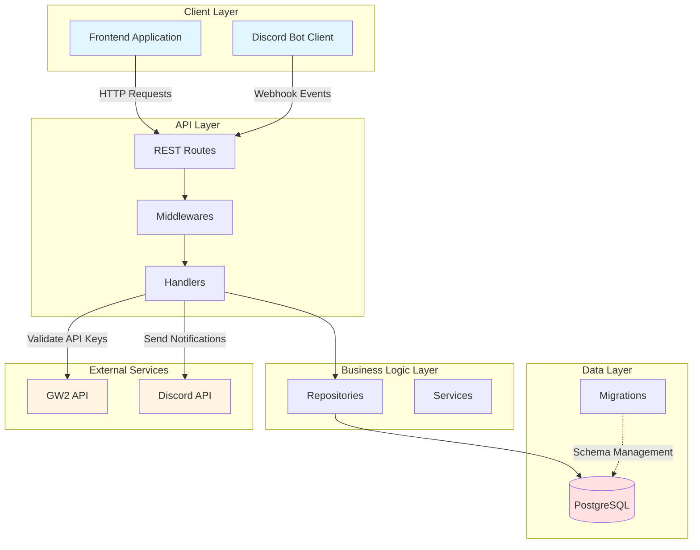

# GW2STYLE Backend - Project Overview

## 🎯 Purpose

**GW2STYLE** is a community-driven fashion archive platform for Guild Wars 2 players. The backend provides a REST API that enables players to:

- Authenticate using their Guild Wars 2 API keys (passwordless authentication)
- Create and share character outfit posts with detailed equipment information
- Browse, search, and filter outfit submissions
- Like and interact with community content
- Moderate content through Discord bot integration

The platform is designed to be **free, open-source, and community-managed**, providing a central hub for GW2 fashion creativity.

---

## 🏗️ Architecture Summary

GW2STYLE follows a **clean architecture** pattern with clear separation of concerns:



### Architecture Layers

1. **REST API Layer** (`rest/`)
   - Routes definition and HTTP request handling
   - Middleware chain (auth, CORS, logging, recovery)
   - Request validation and response formatting

2. **Handler Layer** (`rest/handlers/`)
   - Business logic orchestration
   - Request/response transformation
   - External API integration (GW2 API)

3. **Repository Layer** (`repo/`)
   - Database operations and queries
   - Data access abstraction
   - Transaction management

4. **Database Layer** (`db/`)
   - PostgreSQL connection management
   - Migration system
   - Schema definitions

5. **Bot Layer** (`bot/`)
   - Discord bot for moderation
   - Webhook handling
   - Reaction-based approval workflow

6. **Configuration Layer** (`config/`)
   - Environment variable management
   - Service configuration
   - Database configuration

---

## 🛠️ Tech Stack

### Core Technologies

| Component | Technology | Version | Purpose |
|-----------|-----------|---------|---------|
| **Language** | Go | 1.25+ | High-performance backend language |
| **Web Framework** | `net/http` | stdlib | Native HTTP server and routing |
| **Database** | PostgreSQL | 17+ | Relational data storage |
| **ORM/Query Builder** | `sqlx` | 1.4.0 | SQL query execution and mapping |
| **Migration Tool** | `sql-migrate` | 1.8.0 | Database schema versioning |
| **Authentication** | JWT | `golang-jwt/jwt/v5` | Stateless user sessions |
| **Discord Integration** | `discordgo` | 0.29.0 | Discord bot functionality |
| **Configuration** | `viper` | 1.20.1 | Environment and config management |
| **Validation** | `validator/v10` | 10.27.0 | Request validation |
| **CORS** | `rs/cors` | 1.11.1 | Cross-origin resource sharing |

### Development Tools

- **Hot Reload**: Air (live reload during development)
- **Build Tool**: Make (task automation)
- **Package Manager**: Go Modules
- **Logging**: `slog` (structured logging)

---

## 📁 Project Structure

```
backend/
├── bot/                      # Discord bot for moderation
│   └── bot.go               # Bot implementation and event handlers
├── cmd/                      # CLI commands
│   └── serve.go             # Server startup command
├── config/                   # Configuration management
│   ├── config.go            # Config struct definitions
│   ├── db_config.go         # Database configuration
│   ├── load_config.go       # Config loading logic
│   └── service_db.go        # Service database setup
├── db/                       # Database layer
│   ├── connection.go        # DB connection management
│   ├── migrate.go           # Migration runner
│   ├── migrations/          # SQL migration files
│   │   ├── 00001-create-users-up.sql
│   │   ├── 00002-create-posts-up.sql
│   │   ├── 00003-create-reports-up.sql
│   │   └── 00004-create-moderation-log-up.sql
│   └── queries/             # SQL query files (if using sqlc)
├── logger/                   # Logging utilities
│   ├── logger.go            # Logger setup
│   ├── trace-handler.go     # Request tracing
│   └── convert-to-json.go   # JSON log formatting
├── repo/                     # Repository layer (data access)
│   ├── user.go              # User repository
│   ├── posts.go             # Posts repository
│   ├── likes.go             # Likes repository
│   └── moderation.go        # Moderation repository
├── rest/                     # REST API layer
│   ├── handlers/            # HTTP request handlers
│   │   ├── handler.go       # Base handler struct
│   │   ├── login.go         # Authentication handlers
│   │   ├── posts.go         # Post CRUD handlers
│   │   ├── create_post.go   # Post creation handler
│   │   ├── likes.go         # Like/unlike handlers
│   │   ├── user.go          # User profile handlers
│   │   ├── admin.go         # Admin/moderation handlers
│   │   ├── reports.go       # Report submission handlers
│   │   └── webhook.go       # Discord webhook handlers
│   ├── middlewares/         # HTTP middlewares
│   │   ├── middleware.go    # Middleware interface
│   │   ├── manager.go       # Middleware chain manager
│   │   ├── auth.go          # JWT authentication
│   │   ├── bot_auth.go      # Bot token authentication
│   │   ├── cors.go          # CORS configuration
│   │   ├── logger.go        # Request logging
│   │   └── recover.go       # Panic recovery
│   ├── utils/               # HTTP utilities
│   │   ├── jwt_generator.go # JWT token generation
│   │   ├── send_data.go     # Success response helper
│   │   ├── send_error.go    # Error response helper
│   │   ├── send_json.go     # JSON response helper
│   │   ├── user_info.go     # User context extraction
│   │   └── permission_checker.go # Permission validation
│   ├── routes.go            # Route definitions
│   └── server.go            # HTTP server setup
├── .env.example             # Environment variable template
├── .air.toml                # Air hot reload configuration
├── go.mod                   # Go module dependencies
├── go.sum                   # Dependency checksums
├── Makefile                 # Build and dev commands
└── main.go                  # Application entry point
```

### Key Directories Explained

#### `bot/`
Discord bot implementation for content moderation. Handles:
- Post approval/rejection via emoji reactions (✅/❌)
- Webhook notifications to moderation channel
- Public announcements for approved posts
- Bot authentication with backend API

#### `config/`
Centralized configuration management using Viper. Loads settings from:
- Environment variables
- `.env` files
- Default values

#### `db/`
Database layer with migration support. Contains:
- Connection pooling configuration
- SQL migration files for schema versioning
- Migration runner using `sql-migrate`

#### `repo/`
Repository pattern implementation for data access. Each repository handles:
- CRUD operations for specific entities
- Complex queries with filtering and pagination
- Transaction management

#### `rest/handlers/`
HTTP request handlers that:
- Parse and validate requests
- Call repository methods
- Format responses
- Handle errors

#### `rest/middlewares/`
Middleware chain for cross-cutting concerns:
- **auth.go**: JWT token validation
- **bot_auth.go**: Discord bot authentication
- **cors.go**: Cross-origin request handling
- **logger.go**: Request/response logging
- **recover.go**: Panic recovery and error handling

---

## 🔑 Key Features

### 1. Passwordless Authentication
- Uses Guild Wars 2 API keys for authentication
- Validates keys against official GW2 API (`/v2/account`)
- JWT-based session management
- No password storage or management overhead

### 2. Content Management
- Create posts with detailed outfit information
- Upload up to 5 images per post (via external URLs)
- Tag-based categorization
- Search and filter functionality

### 3. Community Engagement
- Like/unlike posts
- Leaderboard of popular posts
- User galleries (all posts by a creator)

### 4. Discord-Based Moderation
- All posts start as unpublished
- Moderators approve/reject via Discord reactions
- Automated notifications to moderation channel
- Public announcements for approved posts
- Audit logging for all moderation actions

### 5. Performance Optimizations
- GIN indexes for tag filtering
- Database connection pooling
- Pagination for large datasets
- Efficient query patterns

---

## 📊 Database Schema Overview

The application uses **4 main tables**:

1. **users** - GW2 player accounts
2. **posts** - Outfit submissions
3. **reports** - User-submitted reports
4. **moderation_log** - Audit trail for moderation actions

See [DATABASE_SCHEMA.md](DATABASE_SCHEMA.md) for complete schema documentation.

---

## 🔗 API Endpoints

The backend exposes **15+ REST endpoints** organized into:

- **Authentication**: Login, logout, user info
- **Posts**: CRUD operations, search, filtering
- **Likes**: Like/unlike, status check
- **Moderation**: Publish, reject, reports
- **Admin**: Bot-authenticated endpoints

See [API_DOCUMENTATION.md](API_DOCUMENTATION.md) for complete API reference.

---

## 🤝 Contributing

This is an open-source project by the NesoHQ community welcoming contributions! Areas to contribute:

- Backend endpoints and features
- Database optimizations
- API documentation
- Code quality improvements

Join the discussion on [Discord](https://discord.com/invite/xvArbFbh34)

---

## 📄 License

Open-source project - see repository for license details.

---

**Last Updated**: December 2025  
**Version**: 0.2.0
